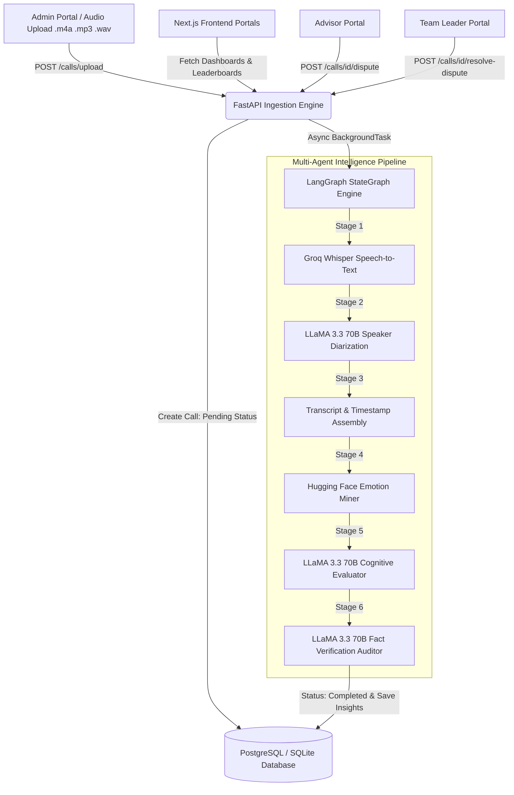

# 🚀 Thankyou For Calling (TFC) — Sales-Call Intelligence Platform

Thankyou For Calling (TFC) is an enterprise sales-call intelligence platform that automates audio call diarization, transcription, cognitive evaluation, and fact-auditing to help sales teams improve call compliance, quality, and coaching at scale.

---

## 📌 Table of Contents
- [About the Project](#-about-the-project)
- [Tech Stack](#%EF%B8%8F-tech-stack)
- [Getting Started](#-getting-started)
  - [Prerequisites](#prerequisites)
  - [Installation](#installation)
- [Usage Examples](#-usage-examples)
- [Architecture & Flow](#%EF%B8%8F-architecture--flow)
- [Contributing](#-contributing)
- [License](#-license)
- [Contact & Support](#-contact--support)

---

## 🔍 About the Project

In traditional sales organizations, Quality Assurance (QA) teams manually review less than **2-5% of recorded calls**. Manual evaluation is slow, expensive, subjective, and prone to evaluator bias, leading to delayed feedback for advisors weeks after customer calls take place.

**Thankyou For Calling (TFC)** solves this by replacing manual sampling with an **asynchronous 6-stage AI agent pipeline**:
- **100% Call Coverage**: Ingests audio files asynchronously in background threads without blocking client interfaces.
- **Fact-Audited Evaluation**: Uses a secondary auditor agent node to eliminate LLM hallucinations by cross-checking extracted quotes directly against timestamped source transcripts.
- **Closed-Loop Dispute Resolution**: Empowers advisors to contest compliance markers and allows team leaders to review and resolve disputes in an active inbox.
- **Zero-Config Database Portability**: Uses SQLModel ORM configured for production PostgreSQL with automatic fallback to local SQLite (`thankyouforcalling.db`).

### Key Features
- **Dual-Speaker Diarization**: Groq Whisper (`whisper-large-v3`) + LLaMA 3.3 70B semantic turn-taking contextual speaker labeling (Advisor vs. Customer).
- **Multi-Agent Evaluation Engine**: LangGraph-orchestrated workflow executing speech recognition, emotion mining (Hugging Face DistilRoBERTa), compliance scoring, and fact auditing.
- **Role-Based Access Control (RBAC)**: 4 specialized user interfaces tailored for **Admin**, **Caller (Advisor)**, **Team Leader**, and **Senior Director**.
- **Interactive Analytics Dashboards**: Quality score distribution donut charts (Good 🟢, Okay 🟡, Bad 🔴), pod performance leaderboards, and top/bottom performer highlights.

---

## 🛠️ Tech Stack

List of primary languages, frameworks, and tools used:
- **Frontend**: Next.js 16 (App Router), React 19, Tailwind CSS, Recharts, Axios, Lucide Icons
- **Backend**: Python 3.10/3.11, FastAPI, Uvicorn, SQLModel, PyJWT, bcrypt, Pydantic v2
- **AI & Agents**: LangGraph 0.4+, Groq Whisper Large v3, Groq LLaMA 3.3 70B Versatile, Hugging Face DistilRoBERTa
- **Database**: PostgreSQL (`psycopg3`) with dynamic SQLite fallback (`thankyouforcalling.db`)
- **Testing & Tooling**: Pytest, Python Subprocess Launcher (`run.py`)

---

## 🚀 Getting Started

Follow these steps to set up the project locally.

### Prerequisites
List of software required:
- **Python**: Version `3.10` or `3.11` installed and added to system PATH.
- **Node.js**: Version `v18.x` or higher installed.
- **npm**: Node package manager installed.

### Installation

1. **Activate virtual environment & install backend dependencies:**
   ```powershell
   # Create virtual environment
   python -m venv .venv

   # Activate virtual environment (Windows PowerShell)
   .\.venv\Scripts\Activate.ps1

   # Install Python requirements
   pip install -r requirements.txt
   ```

2. **Install frontend dependencies:**
   ```powershell
   cd frontend
   npm install
   cd ..
   ```

3. **Set up environment variables:**
   Duplicate the `.env.example` file to create `.env`:
   ```powershell
   copy .env.example .env
   ```

4. **Initialize and seed database roster:**
   Populate default test accounts across all 4 roles:
   ```powershell
   python seed_sample_data.py
   ```

5. **Run the local development servers:**
   Launch both FastAPI (port `5112`) and Next.js (port `5111`) with one command:
   ```powershell
   python run.py
   ```

---

## 💡 Usage Examples

### 1. Accessing the Application Portals
Once running via `python run.py`, open [http://localhost:5111](http://localhost:5111) in your browser:
- **Next.js Web Portal**: [http://localhost:5111](http://localhost:5111)
- **FastAPI REST API**: [http://localhost:5112](http://localhost:5112)
- **Interactive Swagger API Docs**: [http://localhost:5112/docs](http://localhost:5112/docs)

### 2. Standard Test Account Credentials

| Role | Email | Password | Primary Workflow |
| :--- | :--- | :--- | :--- |
| **Admin** | `admin@thankyouforcalling.com` | `Admin@123` | Provision users & upload call audio files |
| **Director** | `sanjay.bose@thankyouforcalling.com` | `Sanjay@123` | View enterprise KPIs & pod rankings |
| **Team Leader** | `rahul.sharma@thankyouforcalling.com` | `Rahul@123` | Review pod quality donut & resolve disputes |
| **Advisor (Caller)** | `aanya.v@thankyouforcalling.com` | `Aanya@123` | View call scores, transcript & submit disputes |
| **Advisor (Caller)** | `disha.s@thankyouforcalling.com` | `Disha@123` | View call scores, transcript & submit disputes |

### 3. Example API Interactions (cURL / Python)

**Login API Request:**
```bash
curl -X POST "http://localhost:5112/auth/login" \
     -H "Content-Type: application/json" \
     -d '{"email": "rahul.sharma@thankyouforcalling.com", "password": "Rahul@123"}'
```

**Upload Call Recording Request (Admin):**
```bash
curl -X POST "http://localhost:5112/calls/upload" \
     -H "Authorization: Bearer <JWT_ACCESS_TOKEN>" \
     -F "advisor_id=3" \
     -F "files=@backend/uploads/sample_call.m4a"
```

---

## 🏗️ Architecture & Flow



### Directory Structure Overview

```text
e:\Job\Thankyou for Calling\
├── backend/                        # FastAPI REST API & LangGraph Processing Package
│   ├── agent/                      # Multi-Agent StateGraph (graph.py, nodes.py, state.py)
│   ├── uploads/                    # Local storage directory for call audio files
│   ├── database.py                 # SQLModel data models & database fallback engine
│   └── main.py                     # API routes, auth dependencies, background runner
├── frontend/                       # Next.js 16 Web Application
│   ├── public/                     # Static media & role avatar graphics
│   ├── src/
│   │   ├── api/                    # Axios client setup (`client.js`) & endpoint routes
│   │   ├── app/                    # Next.js App Router pages (/admin, /caller, /teamleader, /director, /login)
│   │   ├── components/             # Reusable UI components (Header, RoleCard, icons)
│   │   └── context/                # React Context (`AuthContext.jsx`) managing user authentication
│   └── package.json                # Frontend dependencies
├── tests/                          # Automated Pytest Suite
│   └── test_agent.py               # Unit tests for scoring logic & graph verification
├── .env                            # Active environment configuration
├── requirements.txt                # Python backend package dependencies
├── run.py                          # Unified single-command launcher (FastAPI :5112 + Next.js :5111)
├── seed_sample_data.py             # Database seed script for test user roster
├── thankyouforcalling.db           # Local SQLite database (Auto-created fallback)
├── README.md                       # Main project README (this file)
└── PROJECT_EXPLAINED.md            # Deep-dive architectural technical reference
```

---

## 🤝 Contributing

We welcome contributions to the Thankyou For Calling platform!

1. Review our architecture documentation in [**PROJECT_EXPLAINED.md**](PROJECT_EXPLAINED.md).
2. Create a feature branch (`git checkout -b feature/amazing-feature`).
3. Run the automated test suite before committing:
   ```powershell
   .\.venv\Scripts\python -m pytest -v
   ```
4. Open a Pull Request for review.

---

## 📄 License

Distributed under the MIT License. See [LICENSE](LICENSE) for details.

---

## 📬 Contact & Support

- **Project Documentation**: [PROJECT_EXPLAINED.md](PROJECT_EXPLAINED.md)
- **API Swagger Documentation**: [http://localhost:5112/docs](http://localhost:5112/docs)
- **Issue Tracker**: Contact project administrator or log an issue in the repository.
