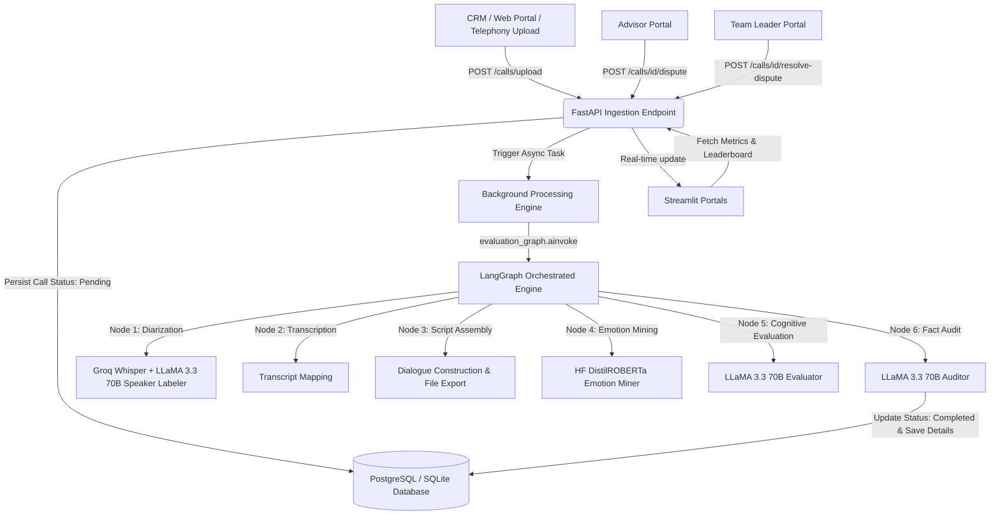

# Thankyou For Calling — Sales-Call Intelligence Platform: Technical Write-up

This document outlines the architecture, system design, analysis engine, database model, and trade-offs of the Thankyou For Calling platform.

---

## A. System Design & Architecture

The Thankyou For Calling platform is designed around a network-decoupled, asynchronous agent architecture to ensure low user latency, high throughput, and high operational reliability.

### 1. Data Flow Diagram


### 2. Architectural Stages
1. **Ingestion Layer (Source-Agnostic)**:
   * Decoupled endpoint (`POST /calls/upload`) accepts raw multipart audio files and an `advisor_id` metadata field.
   * Can ingest calls from telephony exports, dialer webhooks, or manual uploads. It returns an immediate `202 Accepted` response.
2. **Transcription & Diarization**:
   * Raw audio files are passed directly to the Groq Whisper API for speech-to-text transcription.
   * Semantic speaker diarization is performed using LLaMA 3.3 70B to separate Advisor and Customer speakers based on context.
3. **Analysis Engine (LangGraph Orchestration)**:
   * Uses **LangGraph** to orchestrate the entire 6-stage background processing pipeline, including audio diarization, transcript assembly, Hugging Face emotion mining, LLaMA-based cognitive evaluation, and a LLaMA fact-audit to prevent hallucinations.
4. **Storage Layer**:
   * **SQLModel** ORM acts as a database-agnostic interface.
   * Leverages PostgreSQL in production, with an **automatic SQLite fallback (`thankyouforcalling.db`)** for zero-config local evaluation.
5. **Surfacing Layer (Decoupled Front-End)**:
   * Streamlit acts strictly as a lightweight presentation layer, communicating only via JWT-authenticated HTTP requests.
6. **Human-in-the-Loop Feedback**:
   * Advisors can contest compliance marks, raising an active dispute.
   * Team Leaders review disputed calls via their portal inbox and enter resolution notes, closing the loop.

---

## B. Analysis Engine & Edge Cases

### 1. Scoring Rubric & Taxonomy
* **Scoring (Scale 1-10)**:
  * **🟢 Good (Score ≥ 8.0)**: Demonstrates outstanding compliance, discovery, and product value.
  * **🟡 Okay (Score 6.0 - 7.9)**: Average call; meets basic compliance but lacks strong objection handling.
  * **🔴 Bad (Score < 6.0)**: Fails compliance markers or lacks proper customer discovery.
* **Coaching Cards**: The LLM extracts specific, actionable quotes for "Areas of Excellence" and "Growth Areas" instead of generic summaries.

### 2. Edge Case Mitigation Strategies
* **Hindi-English Code-Switching (Hinglish)**: Groq Whisper is prompted with Hinglish context hints to maintain high transcription accuracy.
* **Mono Audio / Diarization Issues**: The semantic processor uses transcript-level markers and turn-taking context to differentiate speaker identities even on single-track recordings.
* **API Rate Limits / Failures**: The backend implements exponential backoff with jitter on Hugging Face and Groq API calls.
* **Idempotency**: All jobs are uniquely hashed based on file signature; once marked `Completed`, jobs cannot be duplicate-processed.

---

## C. Data Model (Entity-Relationship)

```
       +------------------+         +------------------+
       |       User       |         |  CallRecording   |
       +------------------+         +------------------+
       | id (PK)          |<--------| advisor_id (FK)  |
       | email (Unique)   |         | filename         |
       | password_hash    |         | status (Pending) |
       | full_name        |         | score            |
       | role (Enum)      |         | tag (Good/Bad)   |
       | team_id (Index)  |         | disputed (Bool)  |
       +------------------+         +------------------+
                ^                            |
                |                            |
       +------------------+                  |
       |    CallInsight   |                  |
       +------------------+                  |
       | id (PK)          |<-----------------+
       | call_id (FK)     |
       | type (Excelled)  |
       | detail           |
       +------------------+
```

---

## D. Key Technical Trade-offs & Decisions

### 1. What was built and prioritized:
* **Asynchronous Background Processing**: Switched call evaluation from synchronous execution to `BackgroundTasks` to prevent HTTP request timeouts on large audio files.
* **Visual Excellence**: Built Plotly-driven, interactive team portals, avoiding heavy rendering libraries that could crash client browsers.
* **Database Fallback**: SQLModel is configured to fall back to SQLite when a local PostgreSQL server is unavailable, ensuring instant portability.

### 2. What was NOT built (and why):
* **Real-time Audio Streaming**: Deferred in favor of batch upload analysis. Batch uploads are standard for dialer exports (CRM integrations) and allow more reliable multi-agent reasoning.
* **Self-hosted Speech-to-Text**: Deferred in favor of Groq APIs to keep the codebase lightweight and prevent requiring heavy local GPU resources during evaluation.

### 3. Where the system would fail / Next-stage improvements:
* **Over-reliance on LLM APIs**: Highly subject to rate limits. Next-stage improvement would include a local queue (like Celery/Redis) to manage job retries systematically.
* **Lack of Audio Preprocessing**: Noisy audio (background static, low-quality mic) degradates Whisper transcriptions. Adding an upstream noise-reduction filter (e.g., Demucs or WebRTC VAD) is recommended.
